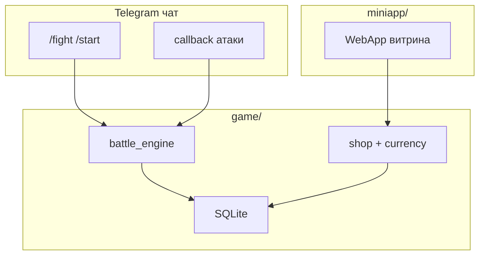
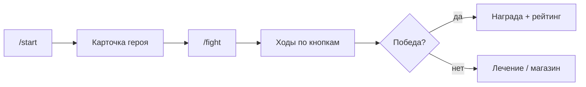
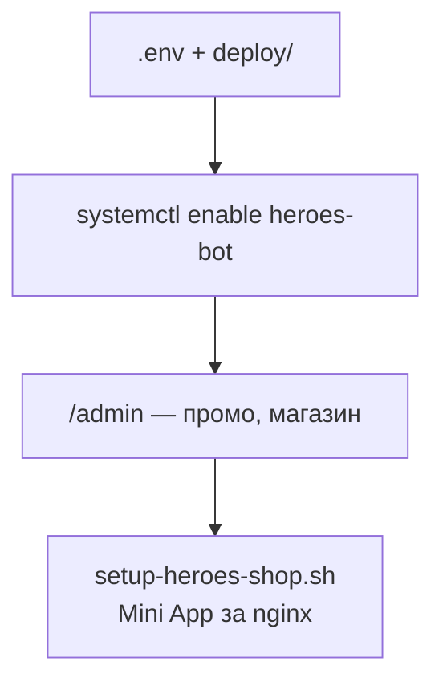

# PvP Game Bot — пошаговые бои в супергруппе

Короче: **регистрация героя → /fight → state machine боя → валюта и магазин**, опционально Mini App.

Задача: оживить супергруппу игрой без отдельного клиента. Бой в треде, баланс и админка — на стороне бота, прогресс в SQLite.

---

## Что сделано

- **battle_engine** — пошаговые атаки, урон, статусы.
- **shop + currency** — золото, предметы, промокоды.
- **handlers** — команды, callback, админка.
- **Mini App** — витрина магазина в WebApp (опционально).
- **systemd + deploy** — скрипты выкладки на VPS.

---

## Фишки и удобство

| Фишка | Зачем |
|-------|-------|
| Inline-кнопки боя | Не парсим текст ходов |
| Тред / invoke | Бой не засоряет весь чат |
| Админ: золото, promo | Баланс без правки БД |
| Mini App | Покупка без выхода из TG |
| SQLite один файл | Бэкап = копия .db |

---

## Схема данных



---

## Процесс пользователя



**Администратор / деплой:**



---

## Стек

| Слой | Технология |
|------|------------|
| Бот | python-telegram-bot |
| Игра | SQLite, state machine |
| Mini App | HTML/JS |
| Демон | systemd |
| Деплой | deploy/remote-setup.sh |

---

## Структура репозитория

```
README.md
LICENSE
.gitignore
heroes_bot.py
handlers/  game/  miniapp/
deploy/    — systemd, nginx shop
docs/                     — DIAGRAMS.md (3× mermaid)
examples/.env.example
```

---

## Быстрый старт

```bash
cp .env.example .env
systemctl enable --now heroes-bot
# Mini App: deploy/setup-heroes-shop.sh
```
